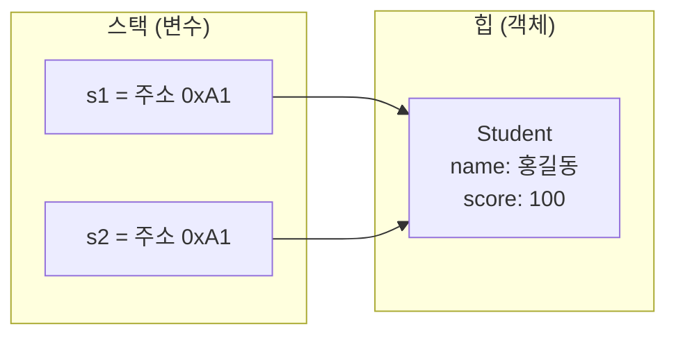

# 일반 변수(기본형) vs 참조 변수 — 도식 정리

Java에서 변수는 크게 **기본형(primitive)** 과 **참조형(reference)** 으로 나뉩니다.

---

## 1. 한눈에 비교

| 구분 | 기본형 (일반 변수) | 참조형 |
|------|-------------------|--------|
| 저장 내용 | **값 자체** | **객체의 주소(참조)** |
| 예시 타입 | `int`, `double`, `boolean`, `char`… | `String`, `Integer`, 배열, 클래스 객체 |
| 메모리 | 주로 스택에 값 저장 | 스택에 주소, 힙에 객체 |
| 기본값 | `0`, `0.0`, `false` 등 | `null` |
| 비교 | `==` 로 값 비교 | `==` 는 주소 비교, 내용 비교는 `equals()` |

---

## 2. 기본형 — 값이 변수 안에 들어감

```java
int a = 10;
int b = a;  // 값 10이 복사됨
b = 20;     // b만 바뀜, a는 그대로 10
```

```text
┌─────────┐         ┌─────────┐
│  a = 10 │         │  b = 10 │   ← 복사 직후
└─────────┘         └─────────┘

b = 20 이후:

┌─────────┐         ┌─────────┐
│  a = 10 │         │  b = 20 │   ← 서로 독립
└─────────┘         └─────────┘
```

> 기본형은 **상자 안에 숫자/논리값이 그대로** 들어 있습니다.

---

## 3. 참조형 — 변수에는 주소만 들어감

```java
Student s1 = new Student("홍길동", 90);
Student s2 = s1;  // 주소 복사 (같은 객체를 가리킴)
s2.setScore(100); // s1이 가리키는 객체도 점수 100
```

```text
스택(변수)                    힙(실제 객체)
┌──────────┐                 ┌─────────────────────┐
│ s1 ──────┼────────────────►│ Student               │
└──────────┘                 │  name = "홍길동"      │
┌──────────┐                 │  score = 100          │
│ s2 ──────┼────────────────►│                       │
└──────────┘                 └─────────────────────┘
     같은 주소를 가리킴
```



> 참조형은 **리모컨(주소)** 이고, 실제 TV(객체)는 힙에 있습니다.

---

## 4. 객체(Object)란?

**객체** = 클래스로부터 `new`로 만들어진 **실체**

```java
Book book = new Book("자바의 정석", "남궁성");
```

```text
클래스(설계도)          객체(실제 책 1권)
┌────────────┐         ┌──────────────────┐
│ class Book │  new →  │ title, author ... │
└────────────┘         └──────────────────┘
                              ▲
                              │
                         book (참조)
```

- 필드(데이터) + 메서드(동작)를 가짐
- 변수 `book`에는 객체가 직접 들어가는 게 아니라 **주소**가 들어감

---

## 5. String — 문자열 객체 (참조형)

`String`은 **클래스**이므로 참조형입니다.

```java
String s1 = "Hello";
String s2 = "Hello";           // 문자열 풀(풀) 공유 가능
String s3 = new String("Hello"); // 새 객체 생성
```

### 도식

```text
String s1 = "Hello";
String s2 = "Hello";

스택                 힙 (String Pool)
┌────┐              ┌─────────┐
│ s1 ┼─────────────►│ "Hello" │
└────┘              └────▲────┘
┌────┐                   │
│ s2 ┼───────────────────┘   ← 같은 리터럴이면 같은 곳 참조 가능
└────┘

String s3 = new String("Hello");

┌────┐              ┌─────────┐
│ s3 ┼─────────────►│ "Hello" │  ← new면 새 객체
└────┘              └─────────┘
```

### 비교 주의

```java
s1 == s2;          // 주소 비교 (같을 수도 있음)
s1.equals(s2);     // 내용 비교 (항상 권장) → true
s1 == s3;          // 보통 false (다른 객체)
s1.equals(s3);     // true (내용은 같음)
```

| 방법 | 의미 |
|------|------|
| `==` | 참조(주소)가 같은지 |
| `equals()` | 문자열 **내용**이 같은지 |

### String 특징

1. **불변(immutable)** — `"Hello"`를 바꿔도 새 문자열이 만들어짐
2. 가장 많이 쓰는 참조형
3. `+`로 연결 가능 (`"안녕" + "하세요"`)

---

## 6. Integer — int의 객체 버전 (래퍼 클래스)

`int`는 기본형이라 `ArrayList` 같은 컬렉션에 바로 못 넣습니다.  
그래서 **객체로 감싼** `Integer`를 씁니다.

| 기본형 | 래퍼 클래스 |
|--------|-------------|
| `int` | `Integer` |
| `double` | `Double` |
| `boolean` | `Boolean` |
| `char` | `Character` |

```java
int n = 10;                    // 기본형: 값 10
Integer obj = Integer.valueOf(10); // 참조형: Integer 객체
Integer auto = 10;             // 오토박싱 (자동으로 Integer로)
int back = auto;               // 언박싱 (자동으로 int로)
```

### 도식

```text
int n = 10;
┌────────┐
│ n = 10 │   ← 값이 바로 들어 있음
└────────┘

Integer obj = 10;  (오토박싱)
┌────┐           ┌──────────────┐
│obj ┼──────────►│ Integer(10)  │  ← 힙의 객체
└────┘           └──────────────┘
```

### ArrayList와의 관계

```java
// ArrayList<int> list;     ❌ 기본형 불가
ArrayList<Integer> list = new ArrayList<>();  // ✅
list.add(10);   // int → Integer 자동 변환(오토박싱)
int x = list.get(0);  // Integer → int 자동 변환(언박싱)
```

```text
ArrayList가 담는 것 = 객체의 참조(주소)

list.get(0) ──► Integer 객체(10)
list.get(1) ──► Integer 객체(20)
```

---

## 7. 세 가지를 나란히 비교

```text
① int (기본형)
┌────────┐
│  10    │  값만 있음. 메서드 없음.
└────────┘

② Integer (참조형 / 래퍼)
┌────┐      ┌─────────────────┐
│ 주소┼─────►│ Integer          │
└────┘      │  value: 10       │
            │  메서드 사용 가능 │
            └─────────────────┘

③ String (참조형 / 문자열 객체)
┌────┐      ┌─────────────────┐
│ 주소┼─────►│ String           │
└────┘      │  "Hello"         │
            │  length(), equals() … │
            └─────────────────┘
```

| | `int` | `Integer` | `String` |
|--|-------|-----------|----------|
| 종류 | 기본형 | 참조형(래퍼) | 참조형(클래스) |
| 저장 | 값 | 주소 → 객체 | 주소 → 객체 |
| null 가능 | ❌ | ✅ | ✅ |
| ArrayList | ❌ | ✅ | ✅ |
| 비교 | `==` | `equals()` 권장 | `equals()` 권장 |

---

## 8. null이란?

참조 변수만 `null`이 될 수 있습니다.  
“아무 객체도 가리키지 않음”입니다.

```java
String name = null;
int age = null;     // ❌ 컴파일 오류 (기본형은 null 불가)
```

```text
┌──────────┐
│ name=null│ ──► (가리키는 객체 없음)
└──────────┘

name.length();  // ❌ NullPointerException
```

---

## 9. 한 줄 요약

1. **기본형** = 상자 안에 **값**
2. **참조형** = 상자 안에 **주소**, 실제 데이터는 **힙의 객체**
3. **객체** = `new`로 만든 실체 (필드 + 메서드)
4. **String** = 문자열을 담는 참조형 객체 (`equals`로 비교)
5. **Integer** = `int`를 객체로 포장한 래퍼 (컬렉션에 넣기 위해 사용)

---

## 관련 예제

- [example2/ReferenceTypes.java](./example2/ReferenceTypes.java)
- [example2/PrimitiveTypes.java](./example2/PrimitiveTypes.java)
- [example9/ListExample.java](./example9/ListExample.java)
