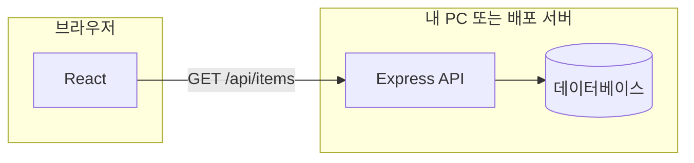

# Node.js + Express API 서버와 React 분리 구조 가이드

## 학습 목표

- React(프론트)와 Express(백엔드 API)를 **별도 프로젝트**로 두는 이유를 이해한다
- Express로 간단한 REST API(CRUD)를 만들 수 있다
- React에서 `fetch` 또는 `axios`로 API를 호출할 수 있다
- 개발 환경에서 **CORS**와 **프록시**를 설정할 수 있다
- Fastify가 Express와 같은 역할임을 알고, 선택 기준을 말할 수 있다

---

## 1. 왜 “분리”해서 만드나요?

| 구분 | 역할 | 실행 위치 |
|------|------|-----------|
| **React** | 화면(UI), 사용자 입력, API **호출만** | 브라우저 |
| **Express** | URL 경로 처리, 비즈니스 로직, **DB 접속** | Node.js 서버 |

- 브라우저에서 DB에 직접 붙으면 **비밀번호·계정이 노출**되므로 하지 않습니다.
- Express는 **서버**에서만 DB에 연결하고, React는 **HTTP(JSON)** 로만 통신합니다.



---

## 2. 전체 작업 순서(처음부터)

1. **Node.js** 설치 확인 (`node -v`, `npm -v`)
2. 폴더 하나에 **Express API 프로젝트** 생성
3. 다른 폴더에 **React 프로젝트** 생성 (Vite 권장)
4. Express에 **CORS** 허용 (또는 Vite **프록시** 사용)
5. Express에 **REST 라우트** 작성 (예: `/api/items`)
6. React에서 **`fetch`로 호출**해 목록 표시·추가·수정·삭제

**폴더 예시(형제 폴더):**

```text
my-fullstack/
├── api-server/      ← Express (포트 예: 3001)
└── web-client/      ← React + Vite (포트 예: 5173)
```

---

## 3. 1단계: Express API 서버 만들기

### 3.1 프로젝트 생성

터미널에서:

```bash
mkdir api-server
cd api-server
npm init -y
npm install express cors
```

- **express**: HTTP 서버·라우팅
- **cors**: 브라우저가 **다른 포트(React)** 에서 API를 부를 때 차단을 풀어줌

### 3.2 최소 서버 코드 (`server.js`)

아래는 **DB 없이 메모리 배열**으로 CRUD를 연습하는 예입니다. (수업·실습에 적합)

```javascript
// api-server/server.js
const express = require('express');
const cors = require('cors');

const app = express();
const PORT = 3001;

app.use(cors()); // 개발: 모든 출처 허용 (운영에서는 origin 제한 권장)
app.use(express.json()); // JSON body 파싱

// 임시 저장소 (서버 재시작 시 초기화됨)
let items = [
  { id: 1, title: '첫 글', done: false },
  { id: 2, title: '둘째 글', done: true },
];
let nextId = 3;

// 목록
app.get('/api/items', (req, res) => {
  res.json(items);
});

// 단건
app.get('/api/items/:id', (req, res) => {
  const id = Number(req.params.id);
  const found = items.find((x) => x.id === id);
  if (!found) return res.status(404).json({ message: '없음' });
  res.json(found);
});

// 추가
app.post('/api/items', (req, res) => {
  const { title, done } = req.body;
  const row = { id: nextId++, title: title ?? '', done: Boolean(done) };
  items.push(row);
  res.status(201).json(row);
});

// 수정
app.put('/api/items/:id', (req, res) => {
  const id = Number(req.params.id);
  const idx = items.findIndex((x) => x.id === id);
  if (idx === -1) return res.status(404).json({ message: '없음' });
  const { title, done } = req.body;
  items[idx] = {
    ...items[idx],
    ...(title !== undefined && { title }),
    ...(done !== undefined && { done: Boolean(done) }),
  };
  res.json(items[idx]);
});

// 삭제
app.delete('/api/items/:id', (req, res) => {
  const id = Number(req.params.id);
  const before = items.length;
  items = items.filter((x) => x.id !== id);
  if (items.length === before) return res.status(404).json({ message: '없음' });
  res.status(204).send();
});

app.listen(PORT, () => {
  console.log(`API 서버 http://localhost:${PORT}`);
});
```

### 3.3 실행 스크립트 (`package.json`)

`"scripts"`에 추가:

```json
"scripts": {
  "start": "node server.js",
  "dev": "node server.js"
}
```

실행:

```bash
npm run start
```

브라우저나 Thunder Client로 확인:

- `GET http://localhost:3001/api/items`

---

## 4. 2단계: React 클라이언트 만들기 (Vite)

상위 폴더로 나와서:

```bash
cd ..
npm create vite@latest web-client -- --template react
cd web-client
npm install
npm run dev
```

기본 주소는 보통 `http://localhost:5173` 입니다.

---

## 5. 3단계: React에서 API 주소 맞추기 (두 가지 방법)

### 방법 A: Vite 프록시 (추천: 개발 편의)

`vite.config.js`에 프록시를 넣으면, React 코드에서는 **`/api`만** 쓰면 Express로 전달됩니다.

```javascript
// web-client/vite.config.js
import { defineConfig } from 'vite';
import react from '@vitejs/plugin-react';

export default defineConfig({
  plugins: [react()],
  server: {
    proxy: {
      '/api': {
        target: 'http://localhost:3001',
        changeOrigin: true,
      },
    },
  },
});
```

React에서 호출:

```javascript
fetch('/api/items').then((r) => r.json());
```

**주의:** Express와 Vite **둘 다 실행** 중이어야 합니다.

- 터미널 1: `cd api-server && npm run start`
- 터미널 2: `cd web-client && npm run dev`

### 방법 B: 전체 URL + CORS

프록시 없이:

```javascript
const API = 'http://localhost:3001';
fetch(`${API}/api/items`).then((r) => r.json());
```

이때 Express에 **`app.use(cors())`** 가 있어야 브라우저가 막지 않습니다.

---

## 6. 4단계: React에서 CRUD 예시 (`App.jsx` 일부)

프록시를 썼다고 가정합니다 (`/api/...`).

```javascript
import { useEffect, useState } from 'react';

const API_BASE = '/api/items';

export default function App() {
  const [list, setList] = useState([]);
  const [title, setTitle] = useState('');

  const load = () =>
    fetch(API_BASE)
      .then((r) => r.json())
      .then(setList)
      .catch(console.error);

  useEffect(() => {
    load();
  }, []);

  const add = () => {
    fetch(API_BASE, {
      method: 'POST',
      headers: { 'Content-Type': 'application/json' },
      body: JSON.stringify({ title, done: false }),
    })
      .then((r) => r.json())
      .then(() => {
        setTitle('');
        load();
      });
  };

  const remove = (id) => {
    fetch(`${API_BASE}/${id}`, { method: 'DELETE' }).then(() => load());
  };

  return (
    <div>
      <input value={title} onChange={(e) => setTitle(e.target.value)} />
      <button type="button" onClick={add}>
        추가
      </button>
      <ul>
        {list.map((row) => (
          <li key={row.id}>
            {row.title}
            <button type="button" onClick={() => remove(row.id)}>
              삭제
            </button>
          </li>
        ))}
      </ul>
    </div>
  );
}
```

`PUT` 수정은 `fetch(\`${API_BASE}/${id}\`, { method: 'PUT', headers: {...}, body: JSON.stringify({...}) })` 패턴으로 동일합니다.

---

## 7. Fastify는 뭐가 다른가요?

- **역할은 Express와 같습니다**: HTTP API 서버를 만듭니다.
- **성능·구조**가 다르고, 플러그인 방식이 강합니다.
- React와의 관계(분리·CORS·프록시)는 **Express와 동일**합니다.

Express에 익숙해진 뒤 “더 빠른 대안”으로 Fastify를 보면 됩니다.

---

## 8. 실제 DB(MySQL 등)를 붙일 때

흐름은 같고, **Express 안에서만** DB 드라이버를 씁니다.

1. `npm install mysql2` (또는 `pg` 등)
2. `server.js`에서 `pool.query(...)` 로 SELECT / INSERT / UPDATE / DELETE
3. 라우트 핸들러에서 결과를 `res.json(...)` 으로 반환

React 쪽 코드는 **URL과 JSON 형식**만 맞으면 거의 그대로입니다.

---

## 9. 배포할 때(개념만)

- **React**: 빌드(`npm run build`) 후 정적 파일을 호스팅(Vercel, Netlify, Nginx 등)
- **Express**: Node가 도는 서버(Railway, Render, 자체 VPS 등)에 올리고 **환경변수**로 DB 접속 정보 관리
- 개발 때 쓰던 `localhost` 주소를 **실제 API 도메인**으로 바꾸거나, 같은 도메인 아래에 API를 두는 방식(리버스 프록시)을 씁니다

---

## 10. 자주 나는 오류

| 증상 | 원인 | 해결 |
|------|------|------|
| CORS 에러 | 다른 포트에서 fetch | Express에 `cors()` 또는 Vite `proxy` |
| 404 on `/api/...` | API 서버 안 뜸 / 포트 틀림 | Express 실행 확인, 포트 3001 등 통일 |
| 프록시인데 404 | Vite만 켜고 API 꺼짐 | `api-server`도 함께 실행 |
| JSON 파싱 실패 | `express.json()` 빠짐 | `app.use(express.json())` 추가 |

---

## 11. 한 줄 정리

**React는 “API 소비자”, Express는 “API 제공자 + DB 접속”** 이고, 둘은 **HTTP(JSON)** 로만 이야기합니다. 스프링·JSP 없이도 이 구조로 풀스택을 만들 수 있습니다.

---

## 참고: 같은 레포에 넣기(모노레포)

초보 단계에서는 **`api-server` / `web-client` 두 폴더**로 나누는 것이 가장 단순합니다. 나중에 `npm workspaces`나 Turborepo로 한 저장소에서 관리할 수 있습니다.
